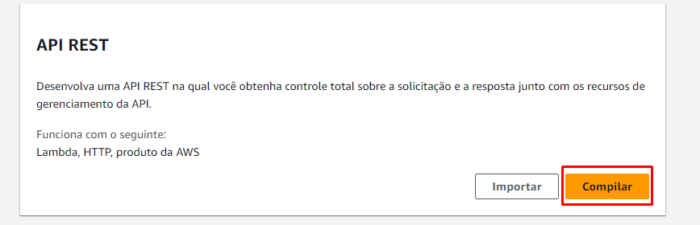

# **Projeto Integração ERP e CRM**

# - _Esse projeto consiste em utilizar uma API para ler um documento ERP do formato JSON e enviar para um CRM_

## - Aviso: Houve testes utilizando o **Serverless Framework**, porém ocorreram algumas falhas na estruturação do mesmo, os testes e detalhes dados a seguir, foram feitos a mão


# - Linguagens e Ferramentas utilizadas

- Python 
- AWS(S3 Bucket, Lambda, API Gateway, IAM)
- Postman

# - Código do Primeiro Lambda
```Python
import os
import logging
import json
import boto3

logger = logging.getLogger()
logger.setLevel(logging.INFO)

def replace_null_with_none(data):
    if isinstance(data, dict):
        return {k: replace_null_with_none(v) for k, v in data.items()}
    elif isinstance(data, list):
        return [replace_null_with_none(item) for item in data]
    elif data is None:
        return "Nenhum"
    else:
        return data

def lambda_handler(event, context):
    logger.info(event)

    bucket_name = os.environ.get("BUCKET_NAME", None)
    try:
        if event and bucket_name:
            s3 = boto3.client("s3")

            path_parameters = event.get("pathParameters", {})
            query_parameters = event.get("queryStringParameters", {})

            user_name = path_parameters.get("username")
            file_name = query_parameters.get("filename")

            if not user_name or not file_name:
                raise ValueError("Missing 'username' or 'filename' in the request parameters")

            if not file_name.endswith('.json'):
                raise ValueError("O arquivo deve ter a extensão .json")

            # Baixar o arquivo JSON do S3
            obj = s3.get_object(Bucket=bucket_name, Key=f"{user_name}/{file_name}")
            data = json.loads(obj['Body'].read())

            # Modificar os dados
            data = replace_null_with_none(data)
            data[-1]['status'] = 'finished'

            # Converter os dados modificados de volta para uma string JSON com formatação
            modified_data = json.dumps(data, indent=4, sort_keys=True)

            # Enviar os dados modificados de volta para o S3
            s3.put_object(Bucket=bucket_name, Key=f"{user_name}/{file_name}", Body=modified_data)

            return {
                "statusCode": 200,
                "headers": {"Content-Type": "application/json"},
                "body": json.dumps({"message": "Modified data has been uploaded to S3 bucket."}),
            }
    except Exception as e:
        logger.error("Exception occurred", exc_info=True)
        return {"statusCode": 500, "body": json.dumps("Error processing the request!")}

    return {"statusCode": 500, "body": json.dumps("Error processing the request!")}
```

# - Código do segundo Lambda

```Python
import boto3
import json
import urllib.request
import urllib.error
import logging

s3_client = boto3.client("s3")
S3_BUCKET = 'test-lambda-api-project'

# Configuração do logger
logger = logging.getLogger()
logger.setLevel(logging.INFO)

def get_crm_endpoint(json_data):
    try:
        # Extrai a URL do servidor do JSON
        server_url = json_data.get("servers", [{}])[0].get("url")
        if server_url:
            return server_url
        else:
            logger.error("URL do servidor não encontrada no arquivo JSON.")
            return None
    except Exception as e:
        logger.error(f"Erro ao obter a URL do servidor do arquivo JSON: {e}")
        return None

def send_to_crm(data, endpoint):
    try:
        # Converte os dados em formato JSON
        data_json = json.dumps(data).encode('utf-8')
        
        # Realiza a requisição POST para o CRM
        req = urllib.request.Request(endpoint, data=data_json, headers={'Content-Type': 'application/json'})
        with urllib.request.urlopen(req) as response:
            if response.getcode() == 200:
                logger.info("Dados enviados com sucesso para o CRM.")
                return True
            else:
                logger.error(f"Falha ao enviar dados para o CRM. Código de status: {response.getcode()}")
                return False
    except urllib.error.HTTPError as e:
        logger.error(f"Falha ao enviar dados para o CRM. Código de erro: {e.code}")
        return False
    except urllib.error.URLError as e:
        logger.error(f"Erro de URL ao enviar dados para o CRM: {e.reason}")
        return False
    except Exception as e:
        logger.error(f"Erro ao enviar dados para o CRM: {e}")
        return False

def lambda_handler(event, context):
    object_key = "Augusto/modified_data2.json"  # substitua pelo objeto correto
    try:
        file_content = s3_client.get_object(Bucket=S3_BUCKET, Key=object_key)["Body"].read().decode('utf-8')
        logger.info("Conteúdo do arquivo do S3: %s", file_content)
        
        # Convertendo o conteúdo do arquivo JSON para um dicionário Python
        data = json.loads(file_content)
        
        # Carrega o arquivo JSON do CRM
        with open('crm_swagger.json') as json_file:
            crm_json = json.load(json_file)
        
        # Obtém o endpoint do CRM a partir do arquivo JSON do CRM
        crm_endpoint = get_crm_endpoint(crm_json)
        
        if crm_endpoint:
            # Enviando os dados para o CRM e registrando se foi enviado com sucesso ou não nos logs
            if send_to_crm(data, crm_endpoint):
                return {
                    'statusCode': 200,
                    'body': "Dados enviados com sucesso para o CRM."
                }
            else:
                return {
                    'statusCode': 500,
                    'body': "Falha ao enviar dados para o CRM. Consulte os logs para obter mais informações."
                }
        else:
            return {
                'statusCode': 500,
                'body': "Erro ao obter o endpoint do CRM. Consulte os logs para obter mais informações."
            }
    except Exception as e:
        logger.error(f"Erro ao processar o arquivo do S3: {e}")
        return {
            'statusCode': 500,
            'body': json.dumps({'error': str(e)})
        }
```

# - A implementação do Postman foi essêncial, já que por padrão precisamos obter algumas chaves de acesso da conta em que estamos utilizando na AWS, e configurá-las no campo de envio do Postman, os detalhes irão ser mostrados posteriormente


# - A configuração do Lambda foi simples, a imagem a seguir mostra a mesma estrutura para ambos os lambdas


# O primeiro lambda, a partir do momento em que criamos o API Gateway e colocamos o método 'GET' e atrelamos ele ao Lambda01, o trigger já está criado, porém no Lambda02 precisa-se manualmente definir o triger, especificamente para o S3 Bucket


# - A configuração do API Gateway também foi simples, precisou-se configurar os Métodos e Recursos para aplicar o protocolo HTTP, e foi implementada apenas no primeiro lambda, a partir do segundo lambda o trigger foi o próprio s3 bucket




# - A imagem abaixo mostra que os parâmetros começando com '/' são recursos, já o único método criado foi o GET, dentro do recurso


# - Houve também a implementação de parâmetros de string na url, já que posteriormente iremos necessitar de enviar o arquivo, juntamente com o tipo do mesmo


# O "Caminhos de Solicitação" ele já é criado quando criamos o recurso dentro de /uploads


# O uso do Postman foi importante, pois pudemos obter algumas informações necessárias do bucket chaves de acesso, para assim fazer o envio do documento ".json" 

# Primeiro Passo: Obter a URL do API Gateway e enviar o Método GET:


# Segundo Passo: Enviar para URL:


# Terceiro Passo: Configurar os campos e usar o método POST na URL obtida anteriormente, juntamente com o arquivo:


# Quarto Passo: Verificar o arquivo no Bucket:


# Quinto Passo: Verificando as Informações Obtidas pelo Lambda01


# Aqui vai algumas dicas: É importante configurar no IAM da sua conta da AWS para fazer com que você possua as permissões de leitura e envio de arquivos:


